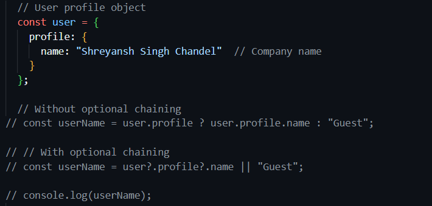

## Q1. How long did you spend on the coding test?
I spent approximately 7-8 hours on the coding test.

## Q2. What was the most useful feature that was added to the latest version of your chosen language? Please include a snippet of code that shows how you've used it.
One of the most exciting additions to React has been React hooks, especially useState and useEffect. These hooks have allowed me to handle state and side effects directly within functional components, making the code more readable and reducing boilerplate. For instance, I used useEffect to load and save tasks to local storage in real-time, keeping user data persistent.

### Code Snippet:

## Q3. How would you track down a performance issue in production? Have you ever had to do this?

To address some performance issues in production, there are a few ways of optimizing the `TACKIFY` component: By using a monitoring tool such as Chrome DevTools, you will find a few resource-heavy parts of the application. The usage of effect dependencies prevents unnecessary re-renders. Other expensive operations, like when filtering tasks, would be good candidates for memoizing using `useMemo` so that they do not need to be recalculated. Also in more enormous applications, you can use lazy loading and code splitting.

## Q4. If you had more time, what additional features or improvements would you consider adding to the task management application?

If I had more time, I would consider adding the following features to the task management application:

- **Collaborative Tasks:** Allow multiple users to collaborate on tasks, assign roles, and track task updates in real time.
- **Notifications & Reminders:** Integrate email or push notifications to remind users about upcoming or overdue tasks.
- **Analytics Dashboard:** Provide insights on task completion rates, productivity trends, and time spent per task.
- **Recurring Tasks:** Enable users to set tasks that automatically recur on daily, weekly, or monthly intervals.
- **Enhanced Search & Filtering:** Implement advanced filters (e.g., by priority, due date range) and search by task content for better organization.
These features would enhance usability, boost productivity, and provide valuable insights to users.

