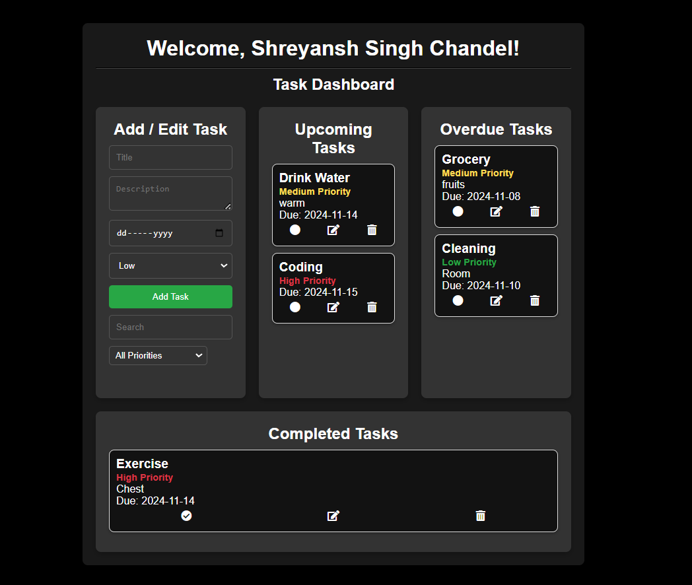

# Task Manager Application

This is a React-based task management application that allows users to add, edit, delete, and categorize tasks based on due dates and priority. It stores tasks locally in the browser and provides options to filter, search, and mark tasks as completed.

## Features

- **Add and Edit Tasks**: Input fields to add new tasks or edit existing ones.
- **Task Filtering and Search**: Filter tasks by priority and search tasks by title or description.
- **Task Categorization**: Tasks are categorized as Upcoming, Overdue, and Completed.
- **Local Storage**: Tasks are saved to the browser's local storage, so they persist between sessions.
- **Responsive Design**: Optimized for various screen sizes.

# React Application Setup Instructions
## Prerequisites
Before setting up the project, make sure you have the following installed:
- **Node.js** (version 12 or higher)
- **npm** (Node Package Manager)

You can verify if these are installed by running the following commands in your terminal:
node -v
npm -v
npx create-react-app task_manager
cd task_manager
npm start

